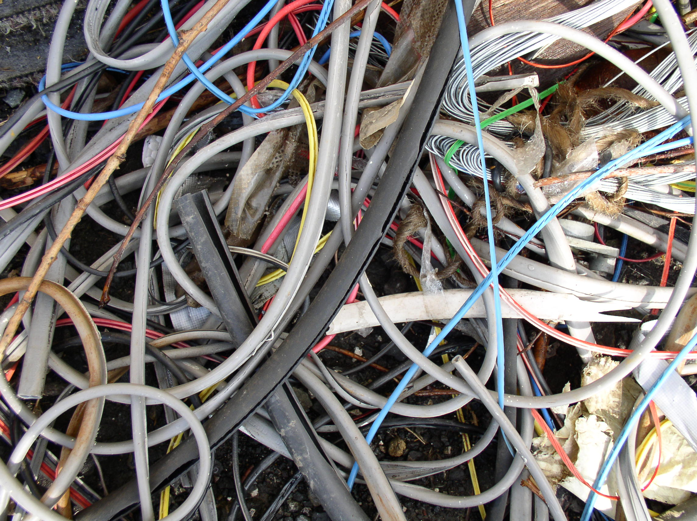
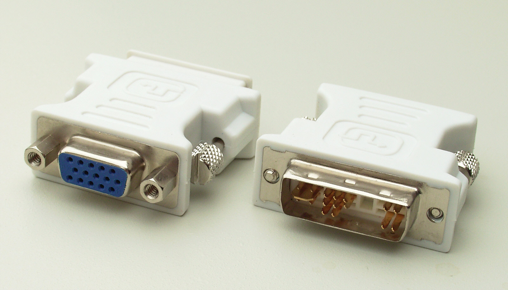

# Blueprints & Hexagons

^ Going to cover two ideas that I was introduced to around the same time. These ideas help solve a number of structural problems in codebases as they get larger. Nothing particularly language or technology specific in this talk.

---

## Who am I?

@garyfleming

^ Software & Agile Consultant, Software Developer for a long time

---

## CodeCraft

- http://codecraftuk.org/
- @CodeCraftUK
- Third Thursday of the month, 7pm. Venue varies.

---

## Problems: Coupling

^ Can mean a lack of separation of concerns, or violation of single responsibility principle
Upgrading between versions of a framework can mean lots of rework due to breaking changes.
Switching to a new library is even worse. Substantial regression testing or a full rewrite are possibilities.

---

## Problems: Organisation/Naming

^ Decided how to organise code gets harder: do we put it somewhere that exists? Where? Somewhere new?
Making the domain obvious over time gets harder - What is the intent of software?

---

## Problems: Harder to Test

^ As coupling increases it's harder to test at all levels. 
Unit tests have more fixtures and set-up.
Integration tests need more of the stack, get slower over time.

---

## Idea 1: Blueprints

^ In his 2011 Ruby Midwest keynote, "Architecture: The Lost Years", Bob Martin argues that intent is lost on most projects from the get go. 

---

## A Guessing Game...

^ This is the top level folder of a real world application: What is does this application do?
"Why does the top-level directory structure communicate that information to you?" i.e. that this is a Rails app (or any tech)
To be clear, I don't want to pick on rails. Other frameworks and technologies are much the same. Open up a typical J2EE app and you'll know that's what it is, but not what it does.

--- 

## Blueprints Scream Intent

^ Top-level blueprint of a church, say, screams intent.
Top-level of software projects scream technology.
An earlier talk I'd seen by someone else (Glenn Vanderburg?), had argued that if we were going to use the civil engineering metaphor for our software, that we should assign the correct roles: we are the architects/designers, the compilers/interpreters are the builders, and the binaries are the end product.
Through this lens, it is obvious that the artifacts that we produce are essentially blueprints. The purpose of blueprints is to show, at varying levels of abstraction, what it is we're trying to build (and how); but not the materials used (not initially, anyway).
That is, if I show you a blueprint for a building, you probably want it to be immediately clear that it is a shopping centre, or a library. You will eventually want to know that it is glass-fronted and sandstone, but it's not the first thing you need to know. ^ Intent first!
How do we structure our code so we reveal the intent as quickly as possible? We'll come back to this.

---

## Idea 2: Hexagonal Architecture

^ Named by Alistair Cockburn (also ports & adapter), it's a way of building adaptable, maintainable, testable systems.
Similar ideas: onion architecture, clean architecture. I'll be using these interchangeably.

--- 

## Why Use Hexagonal:
## Domain Entanglement

^ If we have business logic tied to UI, for example, then it's hard to test, hard to run in batches, hard to drive from another app (via an API)
Same with DB: business logic tied to particular databases, version, stored procedures etc show similar issues
Same with webapps, mail servers, other systems etc.

---

## "...the entanglement between business logic and the interaction with external entities"
### Alistair Cockburn

^ Cockburn realised that the common problems here are caused by "the entanglement between business logic and the interaction with external entities"
Those external entities take lots of forms: DBs, the web, SMTP, other systems, libraries and frameworks that are outwith our control (and many that are within).
Tying the essence of our system, the Domain logic, to anything else other than more domain logic is the root cause for many of the issues we say earlier.

---

## Solution: Ports & Adapters

^ Separate code on the inside (business logic) from code on the outside (external entities), without allowing the inside to have any explicit knowledge of the outside. That is, the web, UI, DB etc can depend on the business logic, but the business logic knows nothing about the external entities driving it or that it is driving.

---

## Ports

^ They allow the inside to express how external entities can interact with them, purely in domain terms.
Think of this like publishing an API: "Speak to me using these messages, with this kind of data that I understand"
In Java or C#, that might look like an Interface. In Objective-C, a protocol. In a more dynamic language, it might just be the kinds of message to which  an object or function on the inside would respond.
The types and names used are part of the protocol/message, but also consider error codes, communication patterns, rate limits, etc

---

# Adapters

^ Obviously, these external entities don't speak the internal domain language: webapps speak HTTP, Databases have their own supported types, so we need to write adapters that convert messages between the style of the port and the external entity.
Small and specific.
Hexagons then are at the heart containing the domain logic/business rules, free from libraries and dependencies
Consider giving each feature (bounded context) its own inner hexagon

---

## Worked example - Animal Shelter

- Adding animals
- Fostering details
- Adoption lists
- Healthcare management
- Follow-up visists
- Letting people know new animals are up for adoption

^ Our domain is adding animals, taking fostering details, maintaining a list of who has adopted an animal, managing healthcare, doing follow-up visits, letting people know about new animals that are up for adoption

---

## Worked example - Animal Shelter

^ Add a new cat
User fills in form details, clicks button, generating an HTTP request.
HTTP request is converted by our framework (Rails, Spring, whatever) into the representation it needs.
Controller (or a more explicit adapter) takes that and converts it into an Animal object/message and sends it to the
"AddAnimal" port (remember this could be a method on an interface, or something else, we don't care).
The inner hexagon does whatever it needs to do (validation, cleanup, rules) and possibly sends a message to the "AnimalStore" port (which has no details of how it will be stored)
On the other side, an adapter converts the message into DB types and instructs the DB to do an insert.
Focus on the ports: the business logic defines them, completely free of any knowledge of the database, the web, or alerting mechanisms. The webapp interacts with the one it cares about, the DB does too.

---

# Problems we've solved?

## Coupling
## Organisation
## Testing

^ Coupling doesn't happen: the inside explicitly does not know about the outside. It doesn't have dependencies.
We create a clear protocol for how to speak to the inside and then anything can do so.
Organisation is clear: the domain logic exists over one or more modules, named for the part of the domain they provide ports with which to interact. The external entity code (adapters) exist in one or more modules named for the the port they interact act with and how (database-animal-store, message-queue-animal-store).
Testing is easier: unit tests don't have external dependencies to mock/fake, integration tests have very clear and explicit boundaries, you may want an end-to-end test but that'll usually just be checking that the glue code works rather than exercising business logic.

---

## Bonus: Null checks

^ Many (usually junior) devs do null check and validation at every point of input (every class, every method) because they're unsure where they should be doing it.
In Hexagonal, it's obvious: you do it as messages enter the ports. By checking for consistency at the edges, we can more easily trust that everything internal to our hexagon is consistent.

---

## Bonus: Microservices

^ If we start with a monolith and want to move to microservices, it helps if we've already split our code up into isolated features that don't know much about the environment in which they are runing, like Hexagonal. Message/protocol based isolation via the ports can easily just send over HTTP etc.
Not a panacea, but a good start.

---

## Back to blueprints

 

^ What would our top-level look like: AnimalManagement, Healthcare, Fosterers, AdoptionDetails, NewAnimalAlerts, FollowUpVisits.
Maybe with a providers subpackage: Database-Animal-Store, SmsAnimalAlerts, EmailAnimalAlerts etc
Put the INTENT and FEATURES at the top-level, not your technology.

---

## Intentional Design

^ Hopefully you've seen how blueprints and hexagonal architecture can help make design more stable over a longer term, and more intentional

---

## Learn More

- [Hexagonal Architecture](http://alistair.cockburn.us/Hexagonal+architecture) by Alistair Cockburn 
- [Architecture, The Lost Years](https://www.youtube.com/watch?v=WpkDN78P884) by "Uncle" Bob Martin
- [Software is an Engineering Discipline](https://www.youtube.com/watch?v=zDEpeWQHtFU) by Glenn Vanderburg

---

## Acknowledgements

- CodeCraft logo by Gary Fleming (copyright CodeCraft)
- [Super Hexagon](http://superhexagon.com/) by [Terry Cavanagh](https://twitter.com/terrycavanagh), [CC-BY-SA-3.0](http://creativecommons.org/licenses/by-sa/3.0/)
- [Entanglement](https://www.flickr.com/photos/dogbomb/526961087), [Simon Brass](https://www.flickr.com/photos/dogbomb/), [CC-BY-SA-2.0](https://creativecommons.org/licenses/by/2.0/)
- Nice Port by Myrabella Photo: [Myrabella](https://commons.wikimedia.org/wiki/User:Myrabella) / [Wikimedia Commons](https://commons.wikimedia.org/wiki/Main_Page) / [CC-BY-SA-3.0](http://creativecommons.org/licenses/by-sa/3.0/) & [GFDL](https://en.wikipedia.org/wiki/GFDL)
- [Rainer Knäpper](https://de.wikipedia.org/wiki/User:Smial), Adapter DVI to VGA, 15/05/06. [Free Art License](http://artlibre.org/licence/lal/en/)
- [Mark Schellhase](https://commons.wikimedia.org/wiki/User:Mschel), Old Chain, [CC-BY-SA-3.0-Unported](https://creativecommons.org/licenses/by-sa/3.0/deed.en)
